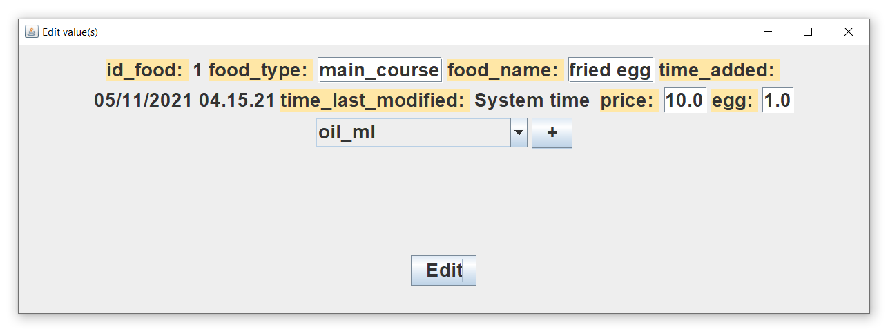

# customizable-restaurant-operating-system-with-Java-MySQL

## Index 
### [Introduction](#intro)
### [Setting up before use](#set)
### [How this System works](#how)
### [How to use: Open client and Login](#login)
### [How to use: Management client](#management)
### [How to use: Waiter client](#waiter)
### [How to use: Kitchen client](#kitcten)
### [How to use: Casher client](#casher)
### [System Requirement](#requirement)
### [License, statement, and special thanks](#licen)

<h3 id="intro"> Introduction</h3>
This is a customizable restaurant operating system that uses Java MySQL JDBC. It includes 4 clients program for management, waiter, kitchen, and cashier. This system 
is designed for small to medium size restaurants. The system allows users to monitor and manage different kinds of ingredients stock(all customizable) and set up 
different kinds of foods to sell according to the ingredients' stock with their own recipes. This system also includes a waiter client for ordering the food to 
specific tables. The systems can block the waiter client to order food that have not enough ingredients, and tell the highest possible amount that can be offered. 
Furthermore, this system provides near lives (depends on setting) instructions to the kitchen to fulfill food orders, with the ability to monitor the order status 
likes is it canceled, is it making, is it served to the customer. Not at all, this system allows users to customize the total table numbers in their restaurant for 
payment calculation, order recording, and customizable service charges and discounts. Each time when new customers or new customer groups order after the previous 
checkout, a new unique id will be given to them, and all of their order records will be saved for possible future use. This system also consists of a Cashier client 
that can automatically calculate the money each table has to pay before the customer leaves, and the change required to pay back, which can increase the working 
efficiency of the cashier. All clients in this system consist login system which can prevent non-employees use the system unintentionally in daily operation. Lastly, 
each client has a clock for better time management of the operator.  

Below is the picture consisting of all clients and login window: 
 
All GUI support auto-resize.
  

<h3 id="set"> Setting up before use</h3>
Before using the system, MySQL 8 (recommend MySQL 8.0.26) and Java ((recommend Java 17) should be installed into all devices needed. The Jconnector is already inside 
the program, no need to include it. After setting up the MySQL server, open MySQL Workbench and import the restaurant schemas from file newStart.sql in folder 
"SQL_file" as "restaurant" or other name wanted. If you want to see a simple demo, import demo.sql. After successful import, you can see the same schemas appears in 
the workbench as below: 

The number of table_n tables in this stage is not important as management_client can set it up later.  
Users can include any account(s) into MySQL. I will suggest just giving full access to each account for all tables. Of course, users can decide each accounts' 
privilege according to the systems and their own needs.  

Then, open client_magement, the first window that appears is the login window. Click "Setting" on the top left corner and select "Set connection". Then, a new window 
will appear and ask for "Enter server location", the default is "localhost:3306/restaurant" which means localhost port 3306, MySQL default, the input format is
  
ip:port/schemas
  
Please enter the proper connection setting for the server, click "ok" to apply. Set connection on all 4 clients. After the connection is set, the file "config.inf" on 
the root folder of each client will save the connection information after applying connection information each time, do not edit it to prevent error. If that file is 
deleted, a new file will be created with the default setting.  

Then, return to the management client and log in. Click "Check and set -> Set Table Numbers", a new window will appear, enter the number of customer tables needed, and 
press "ok". This will create enough tables for each customer table in form of table_n start form table_1, and enough rows in customer_status in the database. Please 
reminder that excessive existing tables and rows will not be deleted.  

Then, click "Check and set" on top and choose "Set service charge and discount", a new window appears. In the new window, enter the percentage of service charge and 
discount, which both can be 0, % sign is not needed.  

It is suggested to add food item(s) in food_list with needed ingredients first, then click "Check and set" -> "Add missed ingredient in ingredient_temporary and 
ingredients_management according to food_list" to ensure each ingredient appears on ingredient_temporary and ingredients_management respectively, such that the system 
can works properly.  

<h3 id="how"> How this System works</h3>
Firstly, each client must be login before access to the client, shown as below: 

 
The login.class in each client will first check with the server if the account, password, connection information is valid, if an error return indicates a wrong login/connection 
information, it won't pass information and call the client. If no error, it will pass information (connection information, account, password) to the respective client 
and open it, the login window will then close itself. Then the client will use the connection information given to communicate with the server.
  

The working principle of this system was showed in below graph (suggested to download and open the /photo/principle.png below showed alone for magnified view): 

 
For the tables in this system:  

food_list is used to store food information for their food name, ingredient use pre-make, food type, with when the record added, price, and last edited time.
  
ingreidents_management is used to store ingredient information for how much ingredient stock remains, new stock, how much stock is used.
  
ingreident_temporary is used to store temporary information of food ingredient usage during working hours. It is mainly used by waiter clients to check if the 
requested food order has enough ingredients to fulfill, and for management clients to summarize used ingredients into ingreidents_management. All records in this table 
will be in negative value with ismaking column to show if the food was made. Except for the first row, which will be the ingredients stock on the last update from
management client base on ingreidents_management. By using ingreident_temporary for waiter client to check stock, the efficiency of checking can be optimized, as in 
long operation, ingreidents_management will be very long, making stock calculation speed very slow. But if use ingreident_temporary with regular cleaning of used 
ingredient records and update new calculated ingredient stock by management client, the rows on ingreident_temporary can remain low, which ensures speed of stock
calculation.
  
charge_discount is used to record service charge and discount(%off) percentage, which can be edited by management client and read by cashier client for calculation of 
the payment.
  
customer_status is used to store the status of each customer table in the restaurant, like is that table of the customer was paid, which id_customer should be assigned 
to the next new customer, and what id_customer is currently in which customer table.
  
table_1 to table_n is used to record orders for each customer table in daily operation, including each order's price, amount, is it making, is it served, is it 
canceled.
  
order_record is used to record each order ordered, it stores the time that record added and last modified, order information including food name, food type, which 
customer (by id_customer) order it at which table(customer_table), the order id, amount, total price in the same 1 order, is the order-making, served or canceled. 
Management client can access records from order_record but it is read-only.
  
kitchen is used by the waiter and kitchen client, all orders added by the waiter client will be added to the kitchen and read by the kitchen client to fulfill the 
orders. 

  
For the operation of the system, firstly, the management client has to input the food item for order into the food_list, then management client can add respective 
column(s) for ingredients in ingreident_management and ingreident_temporary if they don't exist when compared to food_list, this is the process (e) in the above graph. 
Management client can add ingredients storage into ingreident_management, but the edit function is disabled for batter management. All ingredients columns' names in 
mentioned three tables are editable, but it was set only one item is allowed to edit at once.   

Then, after entering all food and ingredients stock information, the management client should summarize if any used ingredients stock from ingreident_temporary(only 
choose those ismaking = 1, means ingredients consumed), all summarized ingredients usage record will be removed from ingreident_temporary. The summarized result will 
then be added to ingreidents_management. Management client then calculates the total ingredients stock according to ingreidents_management and updates it to the first 
row of ingreident_temporary, this is the process (a) in the above graph. Please notice that the Management client can also summarize ingredients only according to 
ingreidents_management, without involving ingreident_temporary but that record is for reference and read-only, which will not be used for other purposes.  

After that, the waiter client can get the food data from food_list and display them in the waiter client, which can be sorted according to food type if wanted. The 
waiter client can also get all order data and status separately from table1...table_n for each customer table, and add new order(s) for them into their respective 
customer table, this is the process (b) in the above graph.
  
When ordering new order, the waiter client will first check customer_status to see if that table is paid (check ispaid), if paid which is ispaid = 1, waiter client 
will assign a new id_customer to that table in customer_status according to id_customer_next, then id_customer_next += 1 and ispaid for that customer table change back 
to 0. The respective order(s) presented in respective table1...table_n will also be cleaned up, this is the process (c).
  
When adding new order to a table, the waiter client also creates a new record at order_record as a record with a new unique id_order and at the kitchen for cooker, 
then initialize them with related data(see graph above), this is the process (d). In process (d), before establishing the order, all orders will be checked if 
ingredient stock is enough according to consumption records in ingreident_temporary by adding the first column (positive values) with other columns (which have 
negative values), to check if ingredients are enough. If ingredient stock is not enough, the waiter client will be not allowed to order that order and give an error 
pop-up with a calculated maximum possible amount for that order.
In this case, the ismaking in ingreident_temporary become handy, as no matter if the food was made, the ingredients consumption record respective to the orders can 
present in ingreident_temporary like "reserved" ingredients. As they were not made yet, they will not be removed by the management client in summarizing ingredient 
stock. While the waiter client can still use these records to calculate if ingredient stock is enough for a new order.
  
The waiter client can cancel the order. For a batter operation fluency, the waiter can cancel all orders no matter what status the food is like is served and is 
making. Please tell them to determine by themself if to cancel the order. In the above graph, canceling the order by the waiter client is the process (f), it will set 
is_cancel = 1 respective to the order according to order_id in order_record, kitchen and respective table1...table_n. All action from waiter client to order_record 
should result in an update on time_last_modified according to system time.
  
Kitchen client will read orders from kitchen according to order_id once pre a set interval, it is customizable for a variety of kitchen operation situations. After 
getting the orders, orders will be displayed on the kitchen client to remind chefs to cook the food. To submit the order, the kitchen staff must first click the "Make" 
button, indicating the food is making. Kitchen client will then update ismaking to 1 in respective table1...table_n, kitchen, ingreident_temporary(ismaking only), and 
order_record according to id_order. The same process will be done in case of is served with the "Serve" button, this is the process (g). For the similar process (h), 
it is used to cancel the order. In case of cancel order by the kitchen, then respective order will be removed from the kitchen by kitchen client, iscancel set to 1 in 
table1...table_n and order_record, and remove the respective record from ingreident_temporary if the ismaking is 0, means not made, just reserved. Please notice that 
all updates at order_record will resulting time_last_modified updated to present system time.
  
When an order was canceled by the waiter client, the order row at the kitchen will be removed at the moment when kitchen staff clicks the "Make" or "Serve" button at 
the kitchen client on the respective canceled order. At the same moment, an error pop-up will be given. Because when each time these buttons were clicked, the kitchen 
client will check if the iscannel in the kitchen for that order is 1(canceled) or not. If it is, it will automatically remove the order record (row) from the kitchen 
immediately, such that the canceled order will not be seen or executed at the kitchen client anymore.
  

On the cashier client, it will get all order records from table1...table_n and display them out in itself according to the customer table which the cashier chose. At 
the same time, the cashier will also get the service charge and discount percentage from charge_discount, and get ispaid status at customer_status and show it to the 
cashier. All data from the same customer table(respective table1...table_n) will then be calculated in the cashier client(with some value within the process shown out
to the cashier) and tell how many dollars should the respective customer pay. After that, the cashier can receive payment from the customer. The cashier should then 
enter the received amount of money into the cashier client, if the received amount is not enough, the cashier client will not allow the cashier to receive the payment. 
If the payment is enough, the cashier can receive the money, and the change that needs to return will be calculated and shown to the cashier automatically once the 
payment is received. After a successful payment, the cashier client will update the ispaid status in customer_status for the respective customer table to 1, which can 
then be used by the waiter client for cleaning up precious order records at the respective table1...table_n and assign a new id_customer to a new customer which was 
described above.  

As mentioned orders can be canceled at any stage, this can provide a flexible operation for the restaurant to run. Not at all, The ingredient consumption only starts
counting when order starts making also provides a better insight on actual ingredient usage. Furthermore, the presence of id_customer and customer table numbers allows
better order recording history in order_record, as we can know which customer orders what order(s) at which customer tables.    

The system should work well in daily operation, the graph above should also provide a clear vision of the operation. 
  

<h3 id="login"> How to use: Open client and Login</h3>
To run the client, click the Client_Waiter.jar, Client_Management.jar, Client_Kitchen.jar, or Client_Cashier.jar depends on which client is needed to run. These 
executable .jar can be found in the respective folder name in the executable jar release(Or compile by using source code in source code release).  
When opening any of the clients, the first window that appears is the login window, shown as below picture:
  

To set connection setting, click "Setting" on the top left corner, then select "Set connection", a pop-up window will be shown:
  
The default setting is "localhost:3306/restaurant", localhost at port 3306, in the format of "ip:port/schemas" as mentioned, set it according to the required server 
location. Click "ok" to confirm the change, this will update the config.inf in the root of the client folder, such that it will auto load this setting at next time 
when it open. (If the file does not exist, it will automatically create a new file).  
Then, to login in, enter the account and password to log in. Any wrong connection setting, account name, and password will result in a login failure, which gives a 
pop-up as shown below: 
 
Click "ok" and try again. A successful login will lead to the respective client directly.
  

<h3 id="management"> How to use: Management client</h3>
Below is the GUI of the management client starting with the imported newStart.sql: 
 
To refresh data, click the "Refresh" button. There is nothing yet (default table is ingreidents_management), to which (food_list, ingreidents_management, order_record) 
table to show, click "Database -> Choose Table", then a pop-up appeal to select window: 
 

To start with, choose food_list. Then click the button "Add" to add a new food item to sell. In this example, a fried egg. Enter needed information into the window:
  

For food type, in default, only these options should be input exactly: "appetizer", "main_course", "dessert", "beverage", "others", "special". In case other words were 
entered, that food item can only be seen in the "all" category in waiter client. Select >new< and click "+" for adding a new ingredient at the pop-up window. Then 
enter the number of ingredients it will use. Please remind that the ingredient name cannot have space. 
 

Click "Add" to add an item, new food item appears with respective column(s): 
 

Please notice that in add/edit process, the ingredients that were not selected to add/edit will be given value 0 in add mode, or as it is in edit mode, after the user 
applies change/add. For each food item added, a new id_food will be given in auto-increment. It is possible to reuse id_food, if the last food deleted is the last row, 
then the next new food items will use its food_id. 

In the "Select value(s) to add" window, if ingredient(s) are present in food_list, the user does not need to use >new< again, they can select directly which 
ingredients to add, like below:
  

To add ingredients in ingreidents_management, use mentioned method to open ingreidents_management and add ingredient stock, the GUI is nearly the same. But in 
ingreidents_management, the edit button is disabled for better ingredient management.   

In food_list, when the "Edit" button was clicked with a selected item(click the item row to select), the user can edit each ingredient usage amount of that food 
as shown:
  

Select ingredient to edit, its original amount will then be given. Edit their amount then click "edit" to confirm.
  
Be aware that the maximum allowed variety of ingredients in add or edit mode is 150 only. For food_name, food_type, and event, the maximum length allowed is 200 char, 
you cannot type exist that in add/edit window. In the edit/add window, if the user enters null input or starts input with numbers, an error window pop-up and does not 
allow the user to apply, this can prevent errors happen. In this case, close the pop-up and re-enter the proper value, then try to apply again.
  
After adding a new food item it is a must to add missed column in both ingreidents_management and ingreident_temporary for new ingredient(s). Click"Check and Set ->Add 
missed ingredient in ingredient_temporary and ingredients_management according to food_list" to do so. Then the current view will change to ingredients_management to 
show the change.
  

To initialize how many customer tables to present, click"Check and Set -> Set Table Numbers" and type the number of customer tables wanted to create:
  

All needed tables (for customer tables) in the database and row(s) in customer_status will be created. 
To set any discount and service charge, click "Check and Set -> Set service charge and discount" type in wanted values into the respective place, and click "SET" to 
set them. The default value is 5 for discount, 10 for service charge.  

To do a fast review on the stock based on ingredients_management, click "Check and Set -> Current ingredient stock in ingredients_management (add at last row without 
involving database)" a new row will then appear to show summed stock of each ingredient, this row start with (0.0, 0.0, 0.0) in first three columns:
  

This new row will not be applied to the database in any circumstances.  

Lastly, to summarize the used ingredients in ingredient_temporary into ingredients_management and update the newest ingredients stocks to the first row of 
ingredient_temporary, click"Database-> Summize used ingredient into ingredients_management and update ingredient_temporary", all used ingredient record(s) will be 
calculated and add as a new record(in negative value) in ingredients_management as "sum Up ingredient used in ingredient_temporary and upgrade it" like below (The row arrow is pointing at):
  

It is recommended to update the ingredient stock in ingredient_temporary after ingredients stock changed in ingredients_management, to ensure ingredients stock in 
ingredient_temporary is up to time. 

Please notice that in the above picture row id_event 2 was deleted by using the Delete button, it is available when food_list or ingredients_management is chosen. To 
delete a row, select the row wanted to delete and press "Delete", the selected row will then be deleted.   

Lastly, it is possible to edit column(ingredient name) in both ingredients_management, ingredient_temporary, and food_list, only 1 name can be edited at once. This is 
intended to make employees more careful and think before they enter new ingredient name(s). To edit that, click"edit -> Edit ingredient name base on food_list (One 
ingredient pre-use)". Let say I want to edit item salt into salt_g, do like below:
  

The ingredient to edit can be chosen at the Combobox. Then click "Edit" to apply the change. Make sure all ingredients_management, ingredient_temporary, and food_list 
have the same ingredient on them. After the "Edit" button was clicked, the column name of the wanted ingredient will be renamed to the new name, like below:
  

To close the client, click "X" on the upper right of the frame, or click "Others -> Exit". 
  

<h3 id="waiter"> How to use: Waiter client</h3>
After login in, the waiter client will show up, it's GUI looks like the below picture with some food items available and two established orders in table_1:
  

To see the food list according to food type, select food type at Combobox near "Food type:", the panel that shows the food list will then automatically be sorted to the required food type. Below is the example when selected "main_course", the above one is "all":
  

On the right-hand side of the panel that shows the food list, it is the panel that shows the order(s) that have already been ordered from each customer table. To 
select the customer table,  select the customer table number at Combobox near "Table Number:", all order(s) that customer table ordered will be automatically shown. 
The waiter client can cancel the order by selecting the order in the panel, then click the "Cancel" button. After that, the order will still be in the table, but the 
iscancel status of the order will be changed to 1, which means it was canceled and will not be included in the final payment. Below the order panel, there is a counter 
that shows how much the order(s) is worth in total for each customer table, it will update upon any change/add/cancel in order carried out from the waiter client.  If 
the canceled order is carried out by another client, the waiter client has to refresh the list manually to see the change.  To manually refresh both the food list, 
order list, and the amount of payment, click "Refresh -> Refresh table now". Please also remind that the amount shown does not include service charge and discount, it 
is the total price of orders only.  

The food panel on the left contains information on id_food, food_type, the price for one quantity. While the right order panel shows id_order, food_name, amount, 
summed_price, ismaking, isserved, and iscancel of the respective order(s).  

To order the item, select the food wanted to order first, then choose which table to order at Combobox near "Table Number:". After that, select amount at the " + 0 - " 
region, plus + to add 1, - to reduce 1, then press the "Order" button to add order. The order will then appear in the order panel (it auto-refresh) near the food list 
panel (see the first picture of this client), meaning order success. Once the order was made, all need ingredients will be reserved unless it was canceled before the 
start of making. Please remind that the amount cannot be lower than 0, it will automatically correct to 0 when clicking "-" if the next number is a negative value. If 
the amount is 0 and the "Order" button was clicked, a pop-up gives out to prevent the action. If the order amount is too much, such that ingredient stocks are not 
enough, another pop-up shows to block the action when the "Order" button was clicked, with providing the minimum possible amount to order, see the below picture:
  

Please be reminded that the amount counter " + n - " will not change back to 0 once an order was made, it is intended for faster order efficiency at the same customer 
table for different orders that have the same quantity.  

There is a clock on the upper section of the waiter client for the waiter to have better time management.   

To deselect both/one selected item in either or both food panel and/or order panel, click "Deselect all", all selected items will be deselected. To manually refresh 
the customer table number present, click "Refresh -> Refresh customer table Combobox".To close the client, click "X" on the upper right or click "Others -> Exit".
  

<h3 id="kitcten"> How to use: Kitchen client</h3>
After login, the Kitchen client will show up, the below picture is the GUI with some order examples:
  

Firstly, the kitchen client will refresh the orders at each set amount of seconds, the default is 15 seconds. The auto-refresh function can provide a more convincing 
usage for the cooker. Users can set the refresh interval at "Refresh interval -> Set refresh interval", then, a pop-up shows for entering time in second for the 
refresh interval:
  

Enter the refresh interval in integer second wanted and click "OK" to apply. The next refresh interval and so on will be the newly set interval. The set interval will 
be saved in kconfig.inf in the root folder, such that at the next time the kitchen client opens, the setting can be loaded and applied from that file automatically. 
Please don't edit the kconfig.inf other than using the kitchen client to prevent errors from occurring. Please be reminded that any invalid input like character input 
will not change the refresh interval, and the refresh interval cannot be set to 0s, a pop-up window pop out respectively in these two situations. If the refresh 
interval was set to 1 second, a near-lives refresh of order can be provided. The cooker can click "Refresh now -> Refresh now" to refresh the data instantly.

To fulfill an order, the kitchen must first click the "Make" button near the respective order, which means the food is making, and all ingredients related to that 
order will be assumed as used. After cooking, press the "Serve" button to serve the food. After the "Serve" button is pressed, the order will be removed, which means 
the order was fulfilled. Then, please give the food to the customer who gives the respective order at the respective customer table, which the kitchen client showed 
before near the id. The "Make" button must be pressed before the "Serve" button can be pressed, if not, an error pop-up will be given. When the "Make" button was 
pressed, it will be disabled and goes grey: 
  

The kitchen can press the "Cancel" button at any time to cancel the respective order for a more flexible operation. Once the order was canceled, it will be removed 
from the client. In case of the order was canceled by other clients, the order will still be present in the kitchen client, but the kitchen client will not be able to 
do make or serve. When the kitchen press the "Make", "Serve" button related to a canceled order at any stage of the order, a pop-up given said "Order canceled" then 
remove the order from the kitchen client.  

There is a clock on the upper section of the kitchen client for the kitchen to have better time management. 
  

<h3 id="casher"> How to use: Casher client</h3>
After successful login, the cashier client will show up:
  

To refresh all customer table numbers present in the Combobox near "Table Number", click "Refresh now -> Refresh customer table Combobox now". To refresh other data, 
click "Refresh now -> Refresh data now". To exit the client, click "Others - > Exit".

Choose the customer table in the Combobox to show order(s) from the respective customer table in the panel below. Information of id_order, food_name, amount, 
summed_price, ismaking, isserved, iscancel can be seen. The cashier can cancel any order by selecting the order, and clicking the "Cancel item" button on the right to 
cancel the order, depending on actual data and situation. Canceled order will not disappear but the status "iscancel" becomes 1, and that order will not be considered 
in the payment calculation. On the section that has many number buttons, there is a label that shows either in red "NOT PAID", which means that that customer table was 
not paid or in green "PAID" for a successful payment that was paid from the respective table.   

On the lower part of the client, on the left side shows the price for only food, service charge in percentage, and Original$ (original price, price after service charge). Then to the right side, the discount in percentage. Total$ is the original price after discount, which is the total amount of money that should be received from the respective customer payment.   

To receive the payment, the cashier needs to use the number button in the client and input numbers into the label near "Received $:", use "del" to remove the last number/dot. After entering the received payment, press "Receive". If payment is not enough, pop-up "Received $ is nothing" or if the input is incomplete, pop-up "Incomplete input" gives out, to prevent receive. Once payment is enough, a change will be calculated and shown out near "Change:", please return the change to the customer according to this value. After successful payment, the "NOT PAID"(red) will change to "PAID"(green). For the mentioned, please see the below picture:
  

Once the customer table's payment was made, the respective order(s) will not be removed by the cashier client, instead, the waiter client when the new customer orders at the same table. Before the new customer orders, the respective customer table will be in the "PAID"(green) stage shown in the mentioned section of the cashier client. This allows review of the orders in that customer table before the next customer arrives if needed.
  

<h3 id="requirement"> System Requirement</h3>
Windows10 with Java installed, recommend Java 17 
MySQL 8 installed, recommend MySQL 8.0.26 
Monitor with 1280x1024 or above for each client
  

<h3 id="licen"> License, statement, and special thinks</h3>
This system consisted of management/waiter/kitchen/cashier client, are released under GPLv2 
Copyright (c) 2021 lrex93497. All rights reserved.  

lrex93497 will not be liable for any loss or damage caused by this system and its related programs. 

Special thanks for the LimitDocumentFilter from MadProgrammer on StackOverflow.
